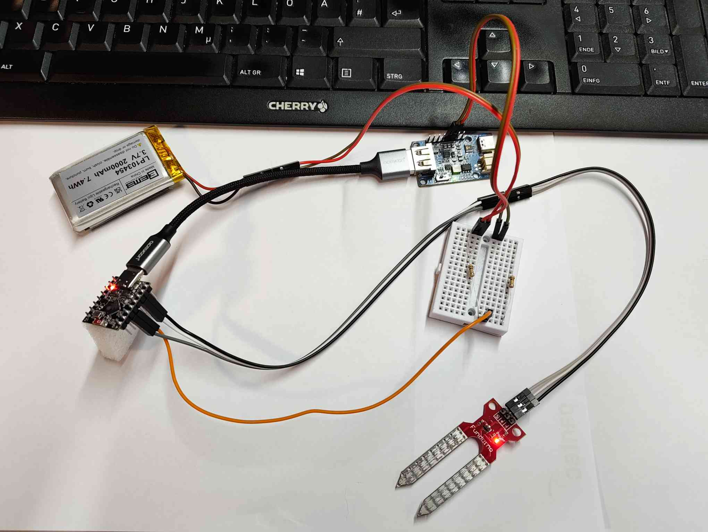

# 🌱 Electric Pot

A battery-powered, WiFi-connected **smart flower pot**. An **ESP32-C3** reads soil
moisture (and battery voltage), sleeps to save power, and sends readings over WiFi
to a **Python FastAPI backend** that stores them in **SQLite** and shows them on a
**live web dashboard with charts**.

```
  ESP32-C3 (Rust firmware)              Python backend (FastAPI)
  ┌───────────────────────┐   WiFi /    ┌────────────────────────┐
  │ • read soil moisture  │   HTTP POST │ • store in SQLite       │
  │ • read battery voltage │ ─────────▶ │ • REST API             │
  │ • deep sleep & repeat │             │ • dashboard (Chart.js) │
  └───────────────────────┘             └────────────────────────┘
                                                   │
                                          open http://<pc-ip>:8000/
```

> Powered by a 2000 mAh LiPo + LiPo Rider Plus, so it runs untethered. Optional
> solar charging, a temp/humidity sensor, and an automatic watering pump are on
> the [roadmap](#-roadmap).

---

## 📑 Contents

1. [Parts list](#-parts-list)
2. [Wiring](#-wiring)
3. [Backend setup (Arch Linux)](#-backend-setup-arch-linux)
4. [Firmware setup (Arch Linux)](#-firmware-setup-arch-linux)
5. [Calibrating the moisture sensor](#-calibrating-the-moisture-sensor)
6. [Using the dashboard](#-using-the-dashboard)
7. [Battery life & solar](#-battery-life--solar)
8. [Roadmap](#-roadmap)
9. [Troubleshooting](#-troubleshooting)

---

## 🧰 Parts list

| Part | What it's for | Status |
|------|---------------|--------|
| **ESP32-C3 mini** | The brain — reads sensors, talks WiFi | ✅ used |
| **LiPo battery, 2000 mAh (3.7 V)** | Power | ✅ used |
| **LiPo Rider Plus** | Charges the LiPo & powers the ESP (5 V out) | ✅ used |
| **Soil moisture sensor** | Measures how wet the soil is | ✅ used (resistive Funduino) |
| **2× 100 kΩ resistors** | Voltage divider to read battery % | ✅ used |
| **Jumper wires + breadboard** | Connections | ✅ used |
| **Solar panel (5–6 V)** | Recharge the LiPo from sunlight | 🔜 planned |
| **Water pump + driver (e.g. 5 V pump + MOSFET/relay)** | Automatic watering | 🔜 planned |
| **DHT22 temp + humidity sensor** | Air temperature & humidity | 🔜 planned |

> 💡 The Funduino moisture sensor is **resistive** — great for testing but it
> corrodes in wet soil over a few weeks. For a permanent install, a **capacitive**
> sensor lasts far longer (just re-calibrate; see [calibration](#-calibrating-the-moisture-sensor)).

---

## 🔌 Wiring



### Connection table

| From (component) | To | Resistor / note |
|------------------|----|-----------------|
| Moisture sensor **VCC** | ESP32 **3V3** | 3.3 V power (not 5 V into the ADC) |
| Moisture sensor **GND** | ESP32 **GND** | — |
| Moisture sensor **AOUT** (analog out) | ESP32 **GPIO2** | analog signal (ADC1) |
| Battery **+** → divider → **GPIO3** | ESP32 **GPIO3** | via **100 kΩ** (R1), see below |
| Divider midpoint → **GND** | ESP32 **GND** | via **100 kΩ** (R2), see below |
| LiPo Rider Plus **5V / OUT** | ESP32 **5V / VBUS** | powers the board |
| LiPo Rider Plus **GND** | ESP32 **GND** | common ground |
| LiPo battery | LiPo Rider Plus **battery JST** | the cell plugs into the charger board |

### Battery voltage divider (so the dashboard can show battery %)

The LiPo is **3.3–4.2 V**, which is above the ESP32-C3 ADC's safe input (~3.3 V).
Two equal **100 kΩ** resistors halve it to a safe ~1.65–2.1 V:

```
  Battery +  (the BAT/+ pin on the LiPo Rider Plus)
      │
   [ R1 = 100 kΩ ]
      │
      ●──────────────►  ESP32 GPIO3   ← midpoint: R1 bottom + R2 top + wire to GPIO3
      │
   [ R2 = 100 kΩ ]
      │
     GND  (shared with the ESP32)
```

- **R1** connects Battery **+** to the midpoint.
- **R2** connects the midpoint to **GND**.
- A wire taps the **midpoint** to **GPIO3**.

The firmware multiplies the ADC reading by `BATTERY_DIVIDER = 2.0` to recover the
real voltage, then maps it to a percentage (4.20 V = 100 %, 3.30 V = 0 %).

> **Why 100 kΩ?** The divider leaks current 24/7. At 4.2 V through 200 kΩ that's
> only ~21 µA — negligible. Smaller resistors would waste battery.
>
> **Ground note:** the ESP32 and the LiPo Rider Plus already share a ground, so
> R2 can go to *either* a GND pin on the ESP32 or a GND pad on the charger — same thing.

---

## 🐍 Backend setup (Arch Linux)

The backend needs Python 3 (Arch ships a recent version). Copy-paste:

```bash
# 1. Install Python (usually already present on Arch)
sudo pacman -S --needed python

# 2. Go to the backend folder
cd backend

# 3. Create a virtual environment
python -m venv venv

# 4. Install the dependencies into the venv
./venv/bin/python -m pip install --upgrade pip
./venv/bin/python -m pip install -r requirements.txt

# 5. Start the server (listens on all interfaces so the ESP32 can reach it)
./venv/bin/python -m uvicorn app.main:app --host 0.0.0.0 --port 8000
```

Or just use the helper script, which does steps 3–5 for you:

```bash
cd backend
./run.sh
```

Then open the dashboard:

- Same machine → <http://localhost:8000/>
- Phone / another PC → `http://<your-PC-LAN-IP>:8000/`

Find your LAN IP with:

```bash
ip addr | grep "inet 192"
```

Use that IP (e.g. `192.168.66.30`) in the firmware's `SERVER_URL` — **not**
`localhost` (that would mean the ESP32 itself).

### Optional: change the secrets

The API key and the dashboard's delete password have safe defaults but can be
overridden with environment variables:

```bash
GARDEN_API_KEY="a-long-random-secret" \
GARDEN_ADMIN_PASSWORD="my-delete-password" \
./run.sh
```

---

## 🦀 Firmware setup (Arch Linux)

The firmware is written in **Rust** using `esp-idf-svc` (std). One-time toolchain
setup:

```bash
# 1. Rust toolchain installer for ESP chips + flashing tools
cargo install espup espflash ldproxy

# 2. Install the ESP Rust toolchain (RISC-V target for the C3)
espup install

# 3. Arch only: the bundled esp-clang needs the old libxml2.so.2
sudo pacman -S libxml2-legacy

# 4. Load the ESP environment (run this in every new shell before building)
. $HOME/export-esp.sh
export PATH="$HOME/.cargo/bin:$PATH"
```

### Configure your WiFi & server

Your real config (with the WiFi password) is **gitignored**. Copy the template
and edit it:

```bash
cp esp32-rust/src/config.example.rs esp32-rust/src/config.rs
```

Then edit `esp32-rust/src/config.rs`:

```rust
pub const WIFI_SSID: &str = "YOUR_WIFI_SSID";
pub const WIFI_PASS: &str = "YOUR_WIFI_PASSWORD";
pub const SERVER_URL: &str = "http://192.168.66.30:8000/api/readings"; // your PC's LAN IP
pub const API_KEY:   &str = "must-match-the-backend";
pub const NODE_ID:   &str = "pot-1";        // unique name per pot
pub const SLEEP_SECONDS: u64 = 900;         // 15 min in normal use (use 30 for testing)
pub const BATTERY_ENABLED: bool = true;     // false if the divider isn't wired yet
```

### Build & flash

Plug the ESP32-C3 into USB, then:

```bash
cd esp32-rust
. $HOME/export-esp.sh
export PATH="$HOME/.cargo/bin:$PATH"
cargo run --release          # builds, flashes, and opens the serial monitor
```

You should see:

```
moisture: 47.3% (raw 2100) | battery: 3.91V (68%)
connecting to WiFi 'YOUR_WIFI_SSID'
WiFi connected, IP: 192.168.66.172
server responded 201
reading uploaded ✓
sleeping for 900s
```

> ⏳ The **first build compiles ESP-IDF from source — 10–20 minutes.** Later
> builds take seconds.

> 🔌 **Can't flash? Port not found?** The chip's USB disappears during deep sleep.
> Hold **BOOT**, tap **RESET**, release **BOOT** to force download mode, then run
> `cargo run --release`. (More in [Troubleshooting](#-troubleshooting).)

---

## 💧 Calibrating the moisture sensor

Do this once so 0 % = dry and 100 % = wet for *your* sensor.

1. Flash the firmware and watch the serial log for the `raw` value.
2. Hold the probe **in dry air** → note the raw → set `MOISTURE_DRY_RAW`.
3. Dip it **in water** (up to the line, not the electronics) → note the raw → set `MOISTURE_WET_RAW`.
4. Re-flash.

Resistive and capacitive sensors read **opposite directions** — the firmware
handles both, you just enter your measured raws:

| Sensor type | In dry air | In water |
|-------------|-----------|----------|
| Resistive (Funduino) | **LOW** raw | **HIGH** raw |
| Capacitive (coated) | **HIGH** raw | **LOW** raw |

---

## 📊 Using the dashboard

- **Status cards:** current moisture, battery %/voltage, online/offline, humidity/temp.
- **Moisture chart** with colored zones — desert-orange/yellow when **dry**, green
  when **just right**, blue when **wet** — so a thirsty pot is obvious at a glance.
- **Battery chart** (percent + voltage).
- **Humidity / Temp chart** — ready for a DHT22 (shows "not wired" until you add one).
- **🗑 Delete button** — wipes readings after entering the admin password.
- Auto-refreshes every 30 s; pick the device and time range at the top.

The backend marks a node **OFFLINE** if no reading arrives within 30 minutes
(configurable via `GARDEN_OFFLINE_AFTER`), so a dead battery or lost WiFi shows up.

---

## 🔋 Battery life & solar

Battery life is dominated by how often the ESP wakes (WiFi is the big drain).
With a **2000 mAh** LiPo, rough estimates:

| `SLEEP_SECONDS` | 2000 mAh lasts |
|-----------------|----------------|
| 30 s (testing) | ~5 days |
| 5 min | ~5 weeks |
| 15 min | ~2 months |
| 30 min | ~2.5 months |

Tips:

- Soil changes slowly — **15–30 min is plenty**. Use 30 s only for testing.
- A strong WiFi signal shortens each wake (faster connect = less battery).
- ☀️ **Heat warning:** LiPo cells degrade above ~45 °C. Keep the **battery in
  shade**; the ESP32 itself is fine in the sun.

**Solar (planned):** a **5–6 V** solar panel plugs into the LiPo Rider Plus solar
input and trickle-charges the battery — a small 1–2 W panel can keep it topped up
indefinitely. ⚠️ Never feed a 12 V/18 V panel into the Rider Plus.

---

## 🛣 Roadmap

Things designed-for but not yet built:

- [ ] **DHT22 temperature + humidity sensor** — backend + dashboard already
      support `temperature` and `humidity` fields; firmware support is the only
      remaining piece. Wiring: VCC→3V3, GND→GND, DATA→a free GPIO (e.g. GPIO4),
      with a **10 kΩ pull-up** between DATA and 3V3.
- [ ] **Solar charging** — 5–6 V panel into the LiPo Rider Plus solar input.
- [ ] **Automatic watering pump** — a 5 V pump driven via a **MOSFET or relay**
      from a GPIO, triggered when moisture drops below a threshold. (Pumps draw
      far more than the ESP — power the pump from the battery/boost rail, not a
      GPIO, and switch it with the MOSFET.)
- [ ] Dashboard alerts / notifications when the pot goes dry.
- [ ] CSV export of readings.

---

## 🛠 Troubleshooting

| Symptom | Cause & fix |
|---------|-------------|
| `No serial ports detected` when flashing | Chip is in deep sleep (USB powers down). Hold **BOOT**, tap **RESET**, release **BOOT** to enter download mode, then flash. |
| Build fails: `libxml2.so.2: cannot open shared object file` | Arch dropped the old lib. `sudo pacman -S libxml2-legacy`. |
| Build fails: `can't find crate for std` | The toolchain pin must be `esp` (set in `rust-toolchain.toml`); run `espup install`. |
| Link error `undefined reference to '__pender'` | The `embassy` Cargo feature must stay **off** (already configured). |
| Moisture reads 100 % in dry air | Calibration direction — resistive sensors read low-raw when dry. See [calibration](#-calibrating-the-moisture-sensor). |
| Dashboard shows times 2 h off | The DB stores **UTC**; the browser converts to local time. Not a bug. |
| `attempt to write a readonly database` | Restart the backend (clears a stale SQLite lock). WAL mode + busy-timeout are enabled to prevent this. |

---

## License

Personal hobby project — use it however you like. 🌿
